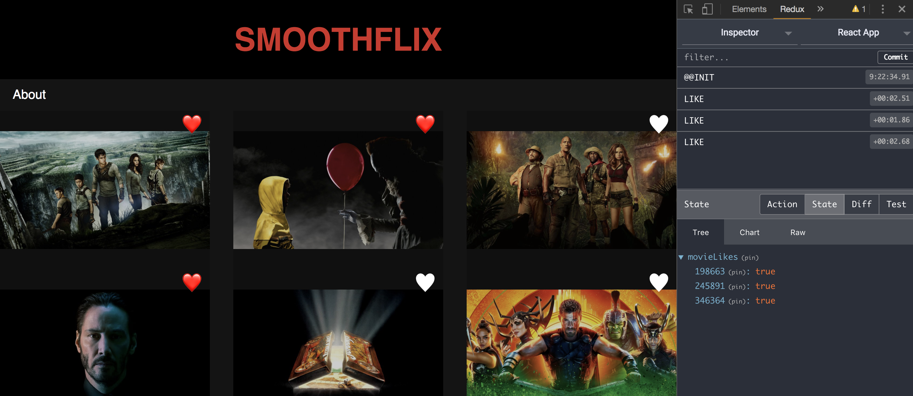

# Exercice 16 : Redux Devtools

## Instructions

Nous souhaitons mettre en place l'extension Redux afin de visualiser notre state plus facilement et pouvoir voyager dans le temps.

* Installer l'extension [Redux Devtools](https://chrome.google.com/webstore/detail/redux-devtools/lmhkpmbekcpmknklioeibfkpmmfibljd?hl=en)
* Ajouter le code nécessaire dans `store.js` pour connecter Redux à l'extension
* Visualiser le state Redux dans l'extension

**Résultat attendu**



## Aide

```js
// Installation de l'extension Redux
export default createStore(
  reducer,
  initialState,
  window.__REDUX_DEVTOOLS_EXTENSION__ && window.__REDUX_DEVTOOLS_EXTENSION__(),
)
```
