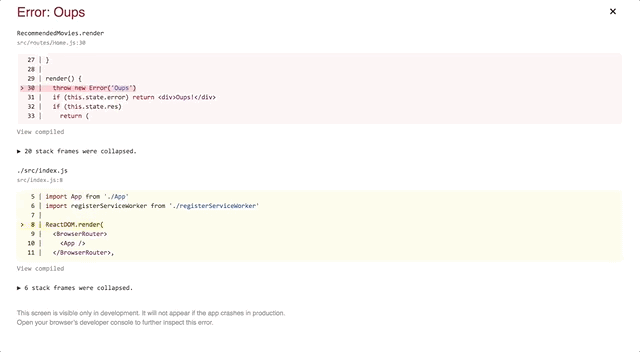

# Exercice 5 : Gestion des erreurs

## Instructions

Nous souhaitons améliorer la gestion des erreurs au sein de notre application.

- Créer un composant `ErrorBoundary`
- Placer le composant à la racine de `App`
- Faire un `throw new Error('Oups')` dans `Home` afin de vérifier que l'erreur est bien interceptée

**Résultat attendu**

L'application averti l'utilisateur qu'une erreur est survenue lorsqu'un composant émet une erreur lors du rendu.



## Aide

```js
// Exemple de ErrorBoundary
class ErrorBoundary extends React.Component {
  state = { hasError: false }

  componentDidCatch(error) {
    this.setState({ hasError: true })
  }

  render() {
    if (this.state.hasError) {
      return <div>Something went wrong.</div>
    }
    return this.props.children
  }
}
```

```js
// Simuler une erreur
render() {
  throw new Error('Oups')
  /* ... */
}
```
