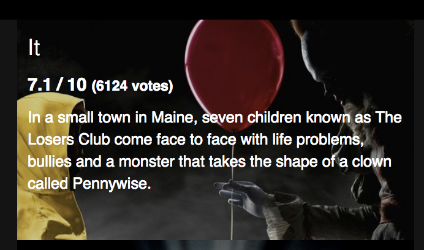

# Exercice 6 : Fragments

## Instructions

Nous souhaitons faire un composant permettant d'afficher la note d'un film et le nombre de votants.

* Créer un composant `MovieVote` acceptant une propriété `movie`. La structure HTML rendue par le composant sera la suivante :

```html
5 / 10 <span style="font-size: 0.8em">(11238 votes)</span>
```

**Résultat attendu**



## Aide

```js
// Utilisation d'un fragment
const MyComponent = () => (
  <React.Fragment>
    Hello <small>little guy</small>
  </React.Fragment>
)
```
