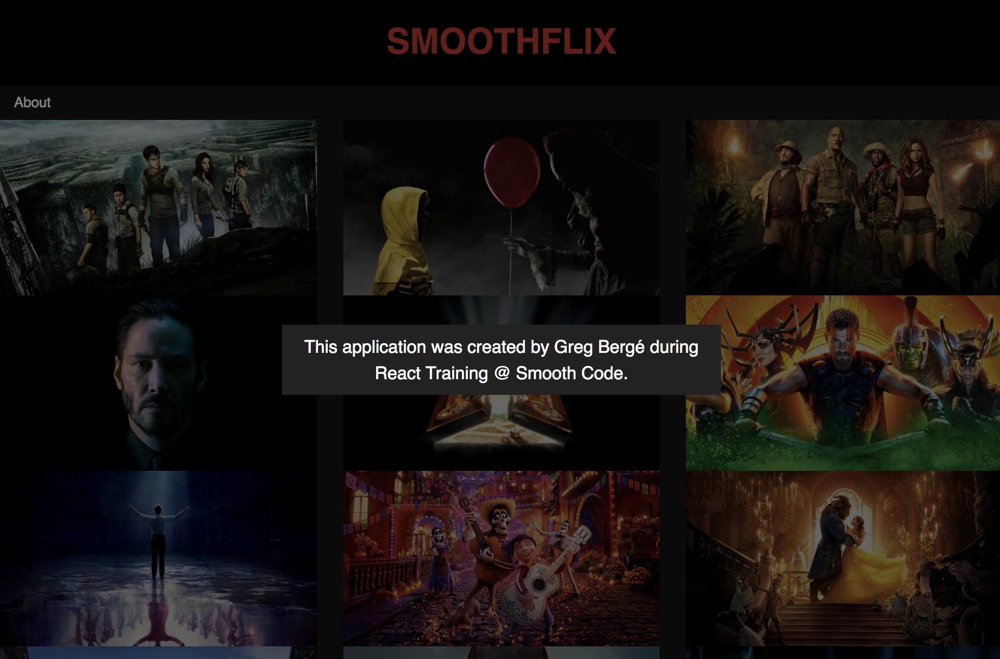

# Exercice 7 : Portals

## Instructions

Nous souhaitons ajouter une page "A propos", cette page devra s'afficher par dessus par liste de films, comme une Popin / Modale.

* Dans `App.js` :

  * Utiliser un `Switch` pour se passer du `exact`
  * Ajouter une barre de navigation sous le header (voir aide)

* Dans `Home`, ajouter une route avec un path "/about"
* En s'inspirant de l'aide, créer un composant `About` qui affichera un message

**Résultat attendu**



## Aide

```js
// About.js
import React from 'react'
import ReactDom from 'react-dom'
import styled from 'styled-components'
import { Link } from 'react-router-dom'

const Backdrop = styled.div`
  position: absolute;
  background-color: rgba(0, 0, 0, 0.5);
  top: 0;
  right: 0;
  bottom: 0;
  left: 0;
  display: flex;
  align-items: center;
  justify-content: center;
`

const Modal = styled.div`
  font-size: 20px;
  text-align: center;
  color: white;
  width: 500px;
  background-color: #222;
  padding: 10px;
`

class About extends React.Component {
  componentWillMount() {
    this.container = document.createElement('div')
    document.body.appendChild(this.container)
    // Block scroll
    document.body.style.overflow = 'hidden'
  }

  componentWillUnmount() {
    document.body.removeChild(this.container)
    // Restore scroll
    document.body.style.overflow = 'visible'
  }

  handleClick = () => this.props.history.push('/')

  render() {
    /* TODO */
  }
}

export default About
```

```js
// Navigation
<ul className="nav">
  <li className="nav-item">
    <Link to="/about" className="nav-link">
      About
    </Link>
  </li>
</ul>
```
